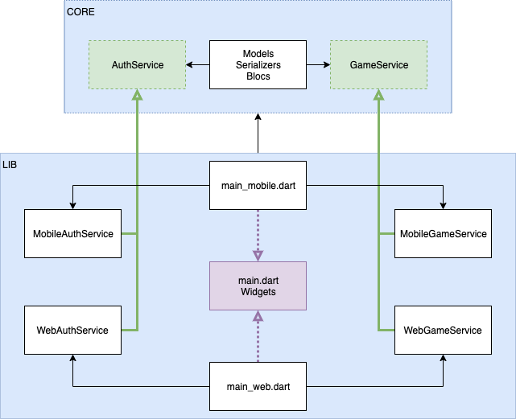

# DevFest 2019 Flutter Workshop by Mews

A simple quiz game to demonstrate cross-platform Flutter development for iOS, Android and Web.

## Architecture

## Branches

- `step-1`: Initial setup. Stub welcome screen. Firebase account is connected and set up.
- `step-2`: Common architecture implementation. `AuthService` and `GameService` are mocked.
- `step-3`: Mobile and web services implemented. Project is ready.

## Credits

- [Trofeo](https://www.2dimensions.com/a/budindepan/files/flare/trofeo/preview) animation by [Gaston](https://www.2dimensions.com/a/budindepan) ([CC BY 4.0](https://creativecommons.org/licenses/by/4.0/))
